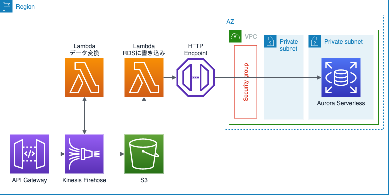
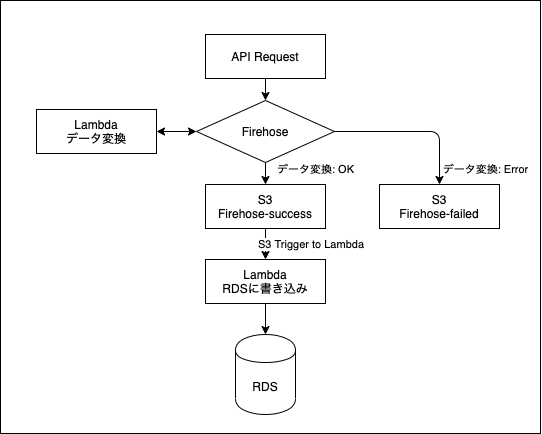
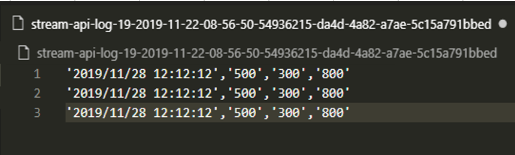
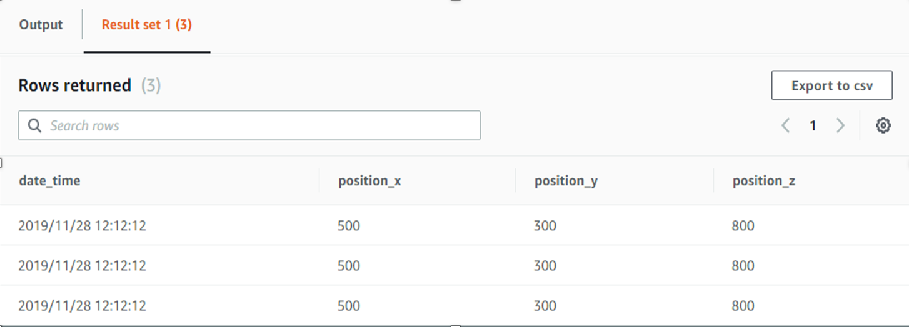

## I. 全体構成:
### 1. 全体構成図:


### 2. Logic Diagram:


### 3. 処理流れ	
- Userから定期的にAPI Gateway呼び出し、位置情報をプッシュする
    - 位置情報はJSONタイプのデータ
- API GatewayからデータをKinesis Firehoseに移動する。
    - Firehoseでデータが一定の時間にバッファされ、現在の設定は1Mbと60秒
	- いずれか上の条件を超えると、JSONデータをCSVタイプに変換するLambdaが呼ばされる
	- Firehoseの結果はS3に保存する。
- S3からRDSにデータを書き込む。
	- DBにデータを書き込めるように
		- Aurora ServerlessのDataAPI機能を使う。
		- VPCの外のLambdaが使う

## II. エラーハンドリング
- API Gatewayのインプットと設定されたサンプルが違う
- Firehoseに溜るデータが大きくて、Lambdaが書き込めない

### 1. API Gatewayのインプットと設定されたサンプルが違う　→　Firehoseでエラーハンドリングされる
- エラーのログはS3の「processing-failed/2020/…」に保存しておく
- エラーを通知できるように、「processing-failed/」のトリガー設定する（未実施）

### 2. Firehoseに溜るデータが大きくて、Lambdaが書き込めない	
- １つクエリ文字列は65532を超えると処理できなくなる。
- 解決方法：データがLambdaに分けられて、Auroraに書き込む（未実施）

## III. デプロイ手順
### 1. ソースコード
- cloudformationテンプレート: bccoe-cfn-template_svl.json
	- API Gateway
	- データ変換Lambda
	- 収集データのS3
	- RDSに書き込みLambda
	- AWS SecretsManager
	- Aurora Serverless (EnableHttpEndpoint: true)
	- VPC, Subnet, Role ...
- Lambdaソースコード
	- firehose-json-to-csv_svl.zip: データ変換Lambda
	- Lambda-DataAPI-Aurora-Svl.zip: RDSに書き込みLambda

### 2. デプロイ手順
- 1. S3バケット作成：
	- バケット名:resource-api-firehose-lambda-rds
- 2. S3にソースコードをアップロード
	- bccoe-cfn-template_svl.json
	- firehose-json-to-csv_svl.zip
	- Lambda-DataAPI-Aurora-Svl.zip
- 3. S3リンクでCloudformation Stack作成（bccoe-cfn-template_svl.jsonのS3リンク）

### 3. 結果確認
- 1. Aurora Serverlessテーブル作成を実行
		```
		var queryString = 'CREATE TABLE stream_data (' +
			'date_time VARCHAR (50) PRIMARY KEY,' +
			'position_x VARCHAR (10) NOT NULL,' +
			'position_y VARCHAR (10) NOT NULL,' +
			'position_z VARCHAR (10) NOT NULL);';
		```

- 2. API GATEWAYを呼び出し
	- データサンプル：
		```
		{
			"Data": {
				"date_time": "2019/11/28 12:12:12",
				"position": {
				"x": 500,
				"y": 300,
				"z": 800
				}
			}
		}
		```
	- S3に保存した結果
	
	
	- RDSに保存した結果
	