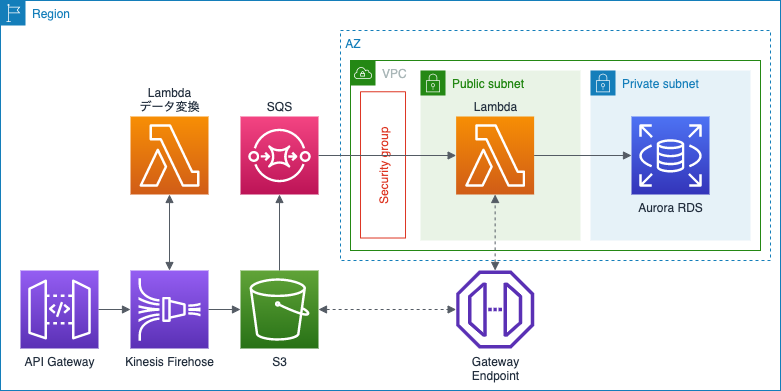
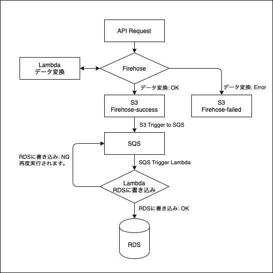
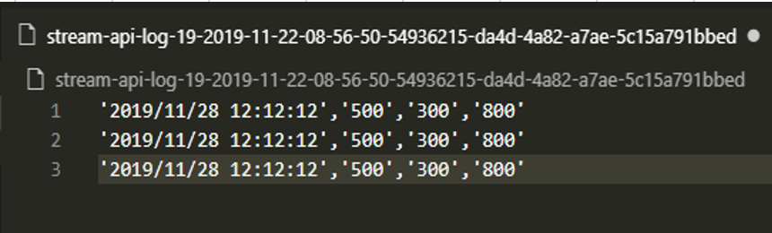
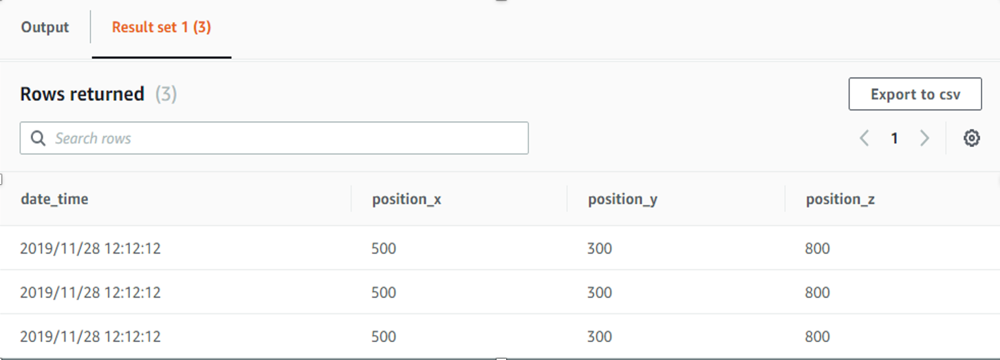

## I. 全体構成:
### 1. 全体構成図:


### 2. Logic Diagram:


### 3. 処理流れ	
- Userから定期的にAPI Gateway呼び出し、位置情報をプッシュする
    - 位置情報はJSONタイプのデータ
- API GatewayからデータをKinesis Firehoseに移動する。
    - Firehoseでデータが一定の時間にバッファされ、現在の設定は1Mbと60秒
	- いずれか上の条件を超えると、JSONデータをCSVタイプに変換するLambdaが呼ばされる
	- Firehoseの結果はS3に保存する。
- S3からRDSにデータを書き込む。
	- SQSにFirehoseのデータを送るためS3トリガー
	- SQSでRDSにデータ書き込むため、Lambdaを呼び出す。

## II. エラーハンドリング							
- API Gatewayのインプットと設定されたサンプルが違う									
- RDSにConnectionの数がオーバーされる									
- Firehoseに溜るデータが大きくて、Lambdaが書き込めない					
									
### 1. API Gatewayのインプットと設定されたサンプルが違う　→　Firehoseでエラーハンドリングされる		
- エラーのログはS3の「processing-failed/2020/…」に保存しておく								
- エラーを通知できるように、「processing-failed/」のトリガー設定する（未実施）
									
### 2. RDSにConnectionの数がオーバーされる　→　SQSに再実行される
- VisibilityTimeout：5秒									
- MessageRetentionPeriod : 60秒									
- エラーを通知できるように、LambdaでSNS呼び出しを設定する（未実施）				
									
### 3. Firehoseに溜るデータが大きくて、Lambdaが書き込めない									
- １つクエリ文字列は65532を超えると処理できなくなる。									
- 解決方法：データがLambdaに分けられて、Auroraに書き込む（未実施）

## III. デプロイ手順
### 1. ソースコード
- cloudformationテンプレート: bccoe-cfn-template_v2.json
	- API Gateway
	- データ変換Lambda
	- 収集データのS3
	- SQS
	- RDSに書き込みLambda
	- VPC Endpoint
	- RDS
	- VPC, Subnet, Role ...
- Lambdaソースコード
	- firehose-json-to-csv_v2.zip: データ変換Lambda
	- SQS-Send-To-RDS_v2.zip: RDSに書き込みLambda
	- Check_data_in_RDS_v2.zip: 
		- RDSにAPIを書き込む前、RDSのテーブル作成する。
		- RDSに書き込まれた結果確認する

### 2. デプロイ手順
- 1. S3バケット作成：
	- バケット名:resource-api-firehose-lambda-rds
- 2. S3にソースコードをアップロード
	- bccoe-cfn-template_v2.json
	- firehose-json-to-csv_v2.zip
	- SQS-Send-To-RDS_v2.zip
	- Check_data_in_RDS_v2.zip
- 3. S3リンクでCloudformation Stack作成（bccoe-cfn-template_v2.jsonのS3リンク）

### 3. 結果確認
- 1. 「API-FIREHOSE-LAMBDA-RDS-CheckRDSFn***」Lambdaを実行
	- 以下のコードを有効にして、実行する
		```
		var queryString = 'CREATE TABLE stream_data (' +
			'date_time VARCHAR (50) PRIMARY KEY,' +
			'position_x VARCHAR (10) NOT NULL,' +
			'position_y VARCHAR (10) NOT NULL,' +
			'position_z VARCHAR (10) NOT NULL);';
		```
- 2. API GATEWAYを呼び出し
	- データサンプル：
		```
		{
			"Data": {
				"date_time": "2019/11/28 12:12:12",
				"position": {
				"x": 500,
				"y": 300,
				"z": 800
				}
			}
		}
		```
	- S3に保存した結果
	
	
	- RDSに保存した結果
	