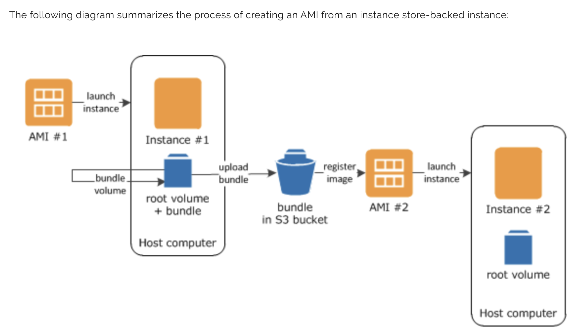
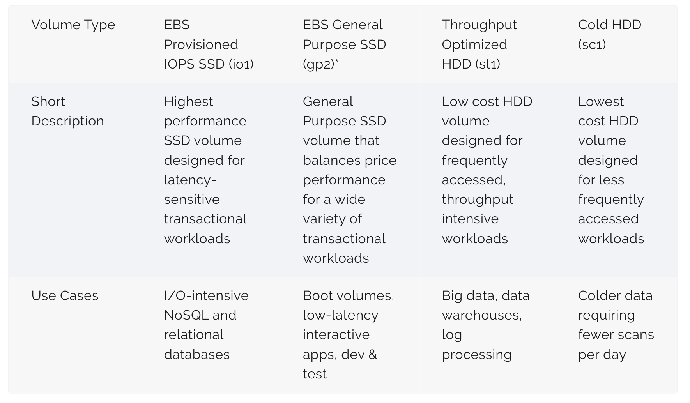
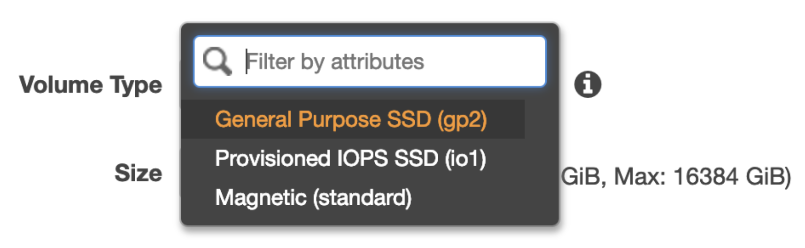
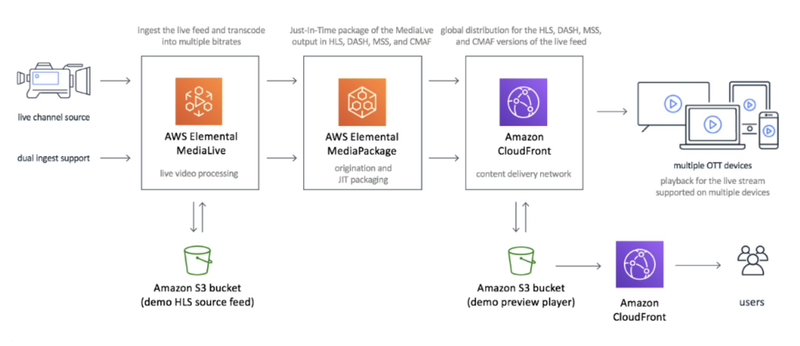
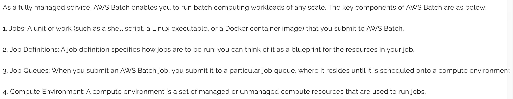
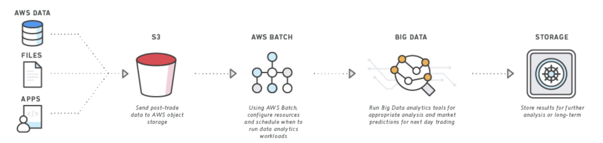
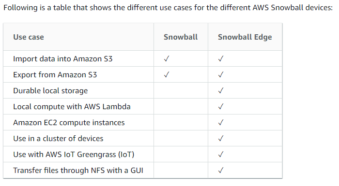
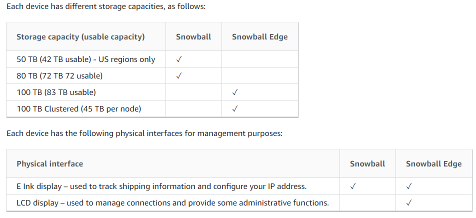

# AWS Config: Nơi theo dõi sự thay đổi của resource
* Khái niệm cơ bản:
    - Đánh giá resource cho thiết kế mong muốn
    - Tạo snapshot cho sự sửa đổi hiện tại, snapshot sẽ được lưu trên S3
    - Lấy lại sự sửa đổi hiện tại hoặc trong quá khứ (Có vẻ giống như Git)
    - Tạo thông báo SNS cho sự tạo mới, xoá, sửa resource
    - Nhìn thấy mỗi quan hệ giữa các resource
* Lưu ý:
    - Khi tạo mới mặc định là all resource trong this region
    - Có thể lựa chọn cho Global
    - SNS mặc định không được tạo
    - Có thể theo dõi được thay đổi được Rule đã được thay đổi trong Security Group ...ect
    - Quan sát resource inventory trong AWS Config, mất một khoảng thời gian để log được ghi lại (~10phút)
        - Thấy được timeline cửa sự thay đổi
        - Thấy được mối quan hệ cửa resource
    - Set Rule trong AWS Config
        - có thể set config theo thay đổi hoặc định kỳ
        - có thể đặt trigger cho resource, Tags hay tất cả thay đổi
        - rule parameters: set theo key-value. vd block cổng nào?? ...
        - complianceType: báo cho kết quả compliant hay non_compliant
    - Có thể set CloudTrail Events

# AWS IoT Architecture
* Cấu trúc:
    1. IoT Devices: Sensor, light ...
    2. Device Gateway: MQTT, HTTP
        - IoT Shadows: Giao tiếp giữa IoT Device và IoT Gateway có thể rời rạc và không đáng tin cậy
            - IoT duy trì shadows như một lưu trữ trạng thái mới nhất. 
            - Shadows có thể query và sẽ nhanh hơn so với giao tiếp trực tiếp
            - Device Shadows cũng có thể được ghi vào nó.
    3. Topic:
        - Như là một cấu trúc Subcribles. Có bao nhiêu thiết bị đang gắn vào và theo dõi ...
    4. IoT Rule:
        - Về cơ bản cho phép các thiết bị sẽ publish trực tiếp đến rules sử dụng $aws/rules/rule-name để tránh phát sinh chi phí khi sử dụng pub/sub
        - Set rule để dữ liệu đi ra Kinesis, S3, DynamoDB, Lambda ...
    5. Analysis: 
        - vd như S3, Add to DynamoDB, Invoke Lambda ...

# AWS Managed Blockchain
- Hiện tại chỉ support N. Virginia

Compliance Frameworks:
- ISO/IEC 27001:2005
- FedRAMP
- HIPAA
- NIST
- PCI (Payment Card Industry Data Security Standard)
- SAS70 Statement on Auditing Standards No. 70
- SOC1 Service Organization Control - accounting standards
- FISMA

# DDOS
- NTP amplification:
- Application Attacks:
    - Flood of GET requests
    - Slowloris: Giữ một request rất chậm

- Minimize the Attack Surface Area
- Be Ready to Scale To Absorb the Attack (chuẩn bị sẵn sàng scale để hấp thụ các sự tấn công)
- Learn Normal Behavior (Các hành vi cơ bản của sự tấn công)
- Tạo Plan cho sự tấn công

# MFA

# STS: Security Token Service
- Cho phép user có quyền hạn access vào aws resource. User có thể đến từ:
    - Federation:
        - Sử dụng SAML (Security Assertion Markup Language)
        -  
    - Federation with Mobile applications 

# AWS WAF & SHIELD
* WAF bảo vệ tầng 7 Application
    - https://www.cloudaxis.com/2016/11/21/waf-sandwich/
    - Bằng việc tạo Web ACL hay IP sets của AWF sẽ có khả năng block Request hay Ip đến App
    - Áp dụng cho API Gateway, ELB, CloudFront
    - Loại bỏ SQL injection
    
* SHIELD
    - Free service (Trừ bản Advanced)
    - Bảo vệ tất cả AWS customer trên ELB, CloudFront và Route53  
    - Bảo vệ tầng 3,4 Network và Transport
    - Bảo vệ DDoS attack
    - Có 2 bản Standard và Advanced (3000USD/Month)

    AWS Shield Advanced Provides:
    - Luôn mở, theo dõi Network Traffic và cung cấp gần như real-time cảnh báo cho sự tấn công DDOS
    - DDOS Response Team (DRT)24x7 quản lý và giảm thiểu tầng Application bị DDOS tấn công
    - Bảo vệ AWS bill không phát sinh chi phí cao hơn do ELB, CloudFront và Route53 bị tấn công DDOS
    - 3000USD/month

# AWS Marketplate
- Có thể mua security products từ bên thứ 3
- Firewalls, Hardened OS's, WAF's, Antivius ...
- Freem Hourly, Monthly ...
- CIS OS Hardening ???

# 7 Tầng OSI
1. Physical:
    - Đảm bảo truyền nhận các chuỗi bit
2. Data Link:
    - Tạo/gỡ Frames, kiểm soát luồng và kiểm soát lỗi 
3. Network:
    - Thực hiện chọn đường và đảm bảo trao đổi thông tin
4. Transport:
    - Transport thông tin giữa các máy chủ (End to End). Kiểm soát lỗi và luồng dữ liệu
5. Session:
    - Quản lý connect, duy trì, đồng bộ
6. Presentation: Giao thức
    - Chuyển đổi cú pháp dữ liệu, biến đổi mã
7. Application:
    - Giao tiếp người dùng và môi trường mạng

# AWS Firewall Manager
- Trung tâm cài đặt và quản lý  firewall rules thông quá acc và app trong AWS Organization
- AWS WAF đã deploy cho nhiều acc có thể được quản lý thông qua chỉ một acc sử dụng AWS Firewall Managed
- Rule Group

# AWS Organization
- https://docs.aws.amazon.com/organizations/latest/userguide/orgs_getting-started_concepts.html
- Quản lý bill của tổ chức thông qua consolidated billing feature
- Mỗi Account chỉ thuộc một tổ chức
- AWS CLI và AWS API cũng có thể tạo Invite (Bên cạnh Mgs console)
- 20 lời mời mỗi ngày cho mỗi một tổ chức 

# AWS Trusted Advisor
- Cost Optimization
- Performance
- Security
- Fault Tolerance
- Service Limits

# S3 & CloudFront
1. sử dụng Cloudfornt để signed URL hoặc signed cookies access đến S3
2. không muốn access trực tiếp lên S3
    - sử dụng Cloudfornt và OAI
    - OAI Origin Access Identity
        - Đảm bảo content S3 is not leacking
        - S3 URL not being used anywhere

# CloudFront
- Có 3 method cho http
    - GET, HEAD
    - GET, HEAD, OPTIONS
    - GET, HEAD, OPTIONS, PUT, POST, PATCH, DELETE -> Có thể sử dụng thêm để submmit data
- Sẽ caches responses đối với GET, HEADER và một phần của OPTIONS request. 
- Các phương thức khác như POST, PUT, PATCH, DELETE sẽ không lưu lại cache

# RDP Remode Desktop Protocol
* The basic steps for configuring RD Gateway are:
    - Create a Windows EC2 instance and configure a security group rule to allow RDP access.
    - Install and configure RD Gateway on that instance.
    - Reconfigure security groups on the RD Gateway instance and all other Windows server 
    　instances to control which connections are allowed.
    - Verify you can connect to your Windows instances through RD Gateway.

# Volume 3 types:
- Object volume -> S3
- Instance store volume 
    - không tạo được snapshot
    - Nhanh với đọc ghi
    - Sẽ bị mất đi khi stop or terminated
    - Backup: 
        - Backup từng file lên S3
        - Tạo một EBS volume attach vào EC2, Migrate instance store volume sang sử dụng disk managerment hoặc migration tool
    
- EBS store volume (EBS, EFS)

# EBS: Restore file trong EBS
- Tạo một volume từ snapshot EBS.
- Attach vào Instance qua một gắn kết khác (diffrence mount location)
- Tiến hành phục hồi file đã bị mất

# EBS: Khi tạo một EBS mã hoá và mount vào một EC2
- Dữ liệu sẽ được mã hoá at-restest
- Các bản snapshot sẽ được mã hoá
- dữ liệu truyền qua lại giữa EBS và Instance sẽ được mã hoá
- Tất cả các volume được tạo tư snapshot này cũng sẽ được mã hoá

# EBS: Snapshot Lifecycle
- Bảo vệ dữ liệu bằng tạo các bản snapshot theo lịch trình
- Giữ lại các bản backup theo yêu cầu của auditor or internal compliance
- Giảm cost lưu trữ bằng việc xoá các bản backup outdated
- Snapshot chỉ có thể theo: 2, 3, 4, 6, 8, 12, 24h 
# EBS Type

- Một EBS Volume có thể thay đổi dạng lưu trữ mà ko cần detach hay restart instance. Nhưng chỉ có một vài lựa chọn cho nó.
- Đối với root volume:

- Đối với non-root volume sẽ có thể thay đổi dạng nhưng giới hạn lưu trữ khá lớn (min 500Gb)

# EFS: Elastic File Storage
- Có thể mount vào EC2 và các instance khác
- Mặc định lúc tạo là multi Az
- Performance dựa vào storage size
- Hỗ trợ 2 loại: Burstring Throughput và Provisioned Throughput
- Mã hoá in-transit và at-rest sử dụng KSM
- Burstring Throughput: cung cấp một giải pháp lưu trữ kiểu burst.

# EFS: Mã hoá
- Lúc tạo ra sẽ chọn được mã hoá -> mã hoá at-rest
- Lúc mount vào instance chọn được mã hoá -> mã hoá in-transit
- In-transit kiểu mã hoá dạng TSL

# AWS CodePipeline
- Lets you create continuous delivery pipelines that track code changes from sources such as CodeCommit, Amazon Simple Storage Service (Amazon S3), or GitHub.
- CodePipeline có support OpsWorks giống như một deployment target

# AWS OpsWorks
- AWS OpsWorks là một dịch vụ cho phép tự động hoá server configuration sử dụng Puppet hoặc Chef
- With AWS OpsWorks, you can provision AWS resources, manage their configuration, 
    deploy applications to those resources, and monitor their health.
- Cho phép quản lý cấu hình cho Application hoặc Operating Systems 
- Cho phép tự động hoá cấu hình server sử dụng Code 

# Microsoft Active Directory
- Simple AD: không kết nối on-premises AD to AWS.
- AWS Directory Service for Microsoft Active Directory (Enterprise Edition):
    AD được đặt hoàn toàn trên Cloud.
- AD Connector: Proxy Service để kết nối AD trên on-premises đến AWS Cloud.

# AWS Redshift
- Redshift Workload Management: Có thể tạo thêm Workload Management Group và assign vào Redshift để xử lý thêm các câu query khác

# Elastic Network Interface
- https://docs.aws.amazon.com/AWSEC2/latest/UserGuide/using-eni.html

# Elastic Transcoder
- Phục vụ cho nhu cầu thay đổi định dạng của Video, Audio
- Thực hiện qua pipeline trong AET và đặt Job trong AET
- Input và Output sẽ chọn 2 bucket khác nhau của S3
    
# AWS Worldocs
- Cung cấp tất cả các resource cần thiết để tạo enterprise-level file sharing solution. 
- Có thể tích hợp với Enterprise Directory Service

# EC2 Type
- Types: https://aws.amazon.com/ec2/instance-types/

# Auto Scaling
- Trước một Auto Scaling Group nên đặt SQS để dự phòng trường hợp đang xử lý Job bị Scale out

# DHCP
* Dynamic Host Configuration Protocol
    - Cung cấp một tiêu chuẩn để passing thông tin sửa đổi (configuration Infomation) để Hosts trên một TCP/IP Network
    - Bạn có thể có nhiều set DHCP
    - Chỉ có thể giao tiếp 1 set DHCP với 1 VPC trong cùng một thời điểm
    - Trường hợp cài đặt lỗi DHCP -> Tạo mới 1 set DHCP mới và associate vào VPC

# KMS
* 2 loại Keys là Master key và Data key
    - Master key: có thể sử dụng trực tiếp mã hoá 4kb data hoặc có thể sử dụng để trực tiếp bảo vệ Data Keys
    - Data key: mã hoá và giải mã dữ liệu khách hàng

# RDS
* Giữ một Read Replica trên on-premises
    - User mysqldump giống như một backup cho RDS để external MySQL 
    - https://docs.aws.amazon.com/AmazonRDS/latest/UserGuide/MySQL.Procedural.Exporting.NonRDSRepl.html
    - Egress rule sẽ cho phép MySQL Read Replica sẽ kết nối tới MySQL DB instance để Replication

# CICD
- Test by ??
- Manuarl Approval ? tạo ở đâu

# Redis Cache
- Có thể modify để upgraded size chứ không downgraded

# Amazon RDS on VMware
- Hiện chỉ support trên US East (Northern Virginia) Region.
- Cài trên on-premise VM

# Database: https://aws.amazon.com/products/databases/

# HSL (HTTP Live Streaming)

- Elemental MediaLive
- Elemental MediaPackage
- GetHLSStreamingSessionURL API sẽ được gọi và trả về HLS Streaming session URL.
- Sử dụng Streaming session URL này để chạy video trên thiết bị (như Apple Safari, Chrome ...).

# AWS Batch

# AWS snowball

- SnowMoblie
    - You can transfer up to 100PB per Snowmobile
    - The Snowmobile is designed to transfer data at a rate up to 1 Tb/s
    - which means you could fill a 100PB Snowmobile in less than 10 days.

# DynamoDB
## Capacity:
- Read: for an item up to 4 KB in size.
    - Strongly consistent read request: 1 
    - Eventually consistent read requests: 2 
    - Transactional read requests: 2

- Write: 1 KB in size
    - Write request unit: 1
    - Transactional write requests: 2

## Amazon DynamoDB Accelerator (DAX):
- Is a fully managed, highly available, in-memory **cache** for DynamoDB that delivers up to a 10x performance improvement – from milliseconds to microseconds – even at millions of requests per second.