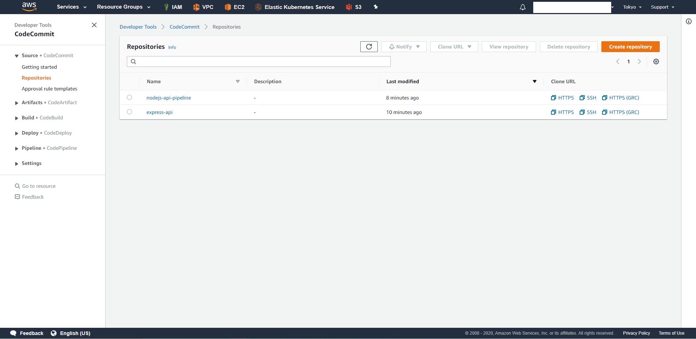

## I. Create Codecommit repository
- repo1 name: express-api
- repo2 name: nodejs-api-pipeline

## II. Upgrade source code to repository

## III. Create resource by cloudfromation template

## IV. User ArgoCD to deploy manifest of nodejs-api-pipeline
### Deploy method is kustomize