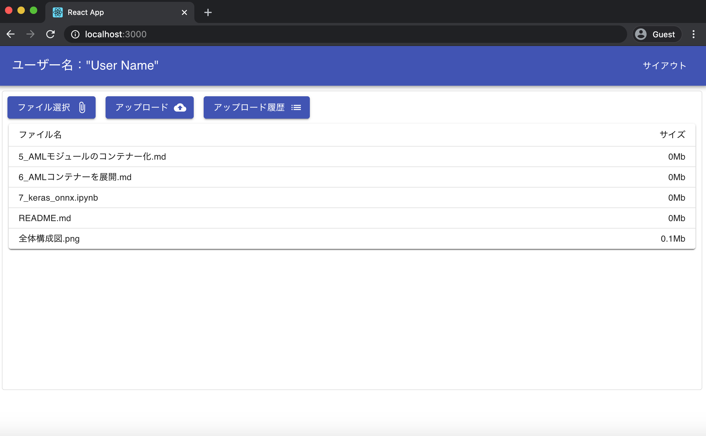

## I. Setup env:
1. Install node
2. Install amplify
- `npm install -g @aws-amplify/cli`
3. Set amplify configure
- `amplify configure`

## II. Create-react-app:
npx create-react-app amplify-upload-file-s3
cd amplify-upload-file-s3
npm start

## III. Initialize a new backend
- `amplify init`
```
? Enter a name for the project amplifyuploadfiles3
? Enter a name for the environment namnd
? Choose your default editor: Visual Studio Code
? Choose the type of app that you're building javascript
Please tell us about your project
? What javascript framework are you using react
? Source Directory Path:  src
? Distribution Directory Path: build
? Build Command:  npm run-script build
? Start Command: npm run-script start
Using default provider  awscloudformation

For more information on AWS Profiles, see:
https://docs.aws.amazon.com/cli/latest/userguide/cli-multiple-profiles.html

? Do you want to use an AWS profile? Yes
? Please choose the profile you want to use default
```

- amplify comand:
```
"amplify status" will show you what you've added already and if it's locally configured or deployed
"amplify add <category>" will allow you to add features like user login or a backend API
"amplify push" will build all your local backend resources and provision it in the cloud
"amplify console" to open the Amplify Console and view your project status
"amplify publish" will build all your local backend and frontend resources (if you have hosting category added) and provision it in the cloud

Pro tip:
Try "amplify add api" to create a backend API and then "amplify publish" to deploy everything
```

### Install Amplify libraries:
- `npm install aws-amplify @aws-amplify/ui-react`

### Set up frontend:
- Open src/index.js and add the following code below the last import:
```
import Amplify from "aws-amplify";
import awsExports from "./aws-exports";
Amplify.configure(awsExports);
```

## IV. Add authentication
- `amplify add auth`
```
? Do you want to use the default authentication and security configuration? Default configuration
? How do you want users to be able to sign in? Username
? Do you want to configure advanced settings?  No, I am done. 
```

- `amplify push`
- `amplify console`

### 1. Create login UI
- Open src/App.js and make the following changes:
- `import { withAuthenticator } from '@aws-amplify/ui-react'`
- `export default withAuthenticator(App)`
- `npm start`
- Login Screen:


### 2. Add Japanese
- add folder: src/i18n
- add src/i18n/vocabularies.js
- Open src/App.js and add code below:
```
import { I18n } from "aws-amplify";
import vocabularies from "./i18n/vocabularies";
I18n.putVocabularies(vocabularies);
I18n.setLanguage("ja");
```
